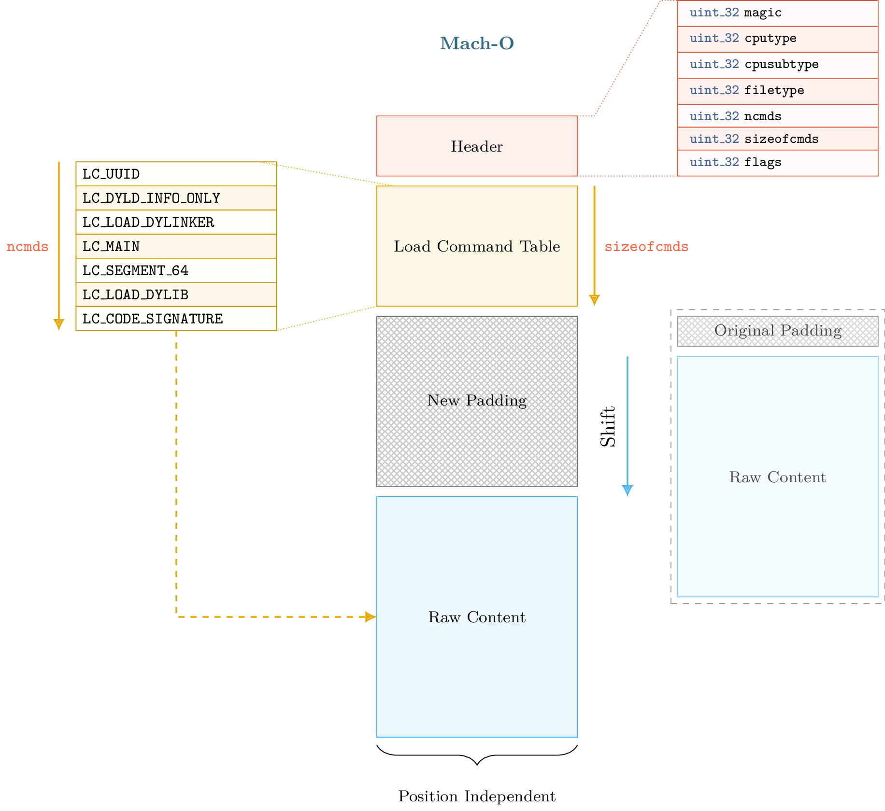
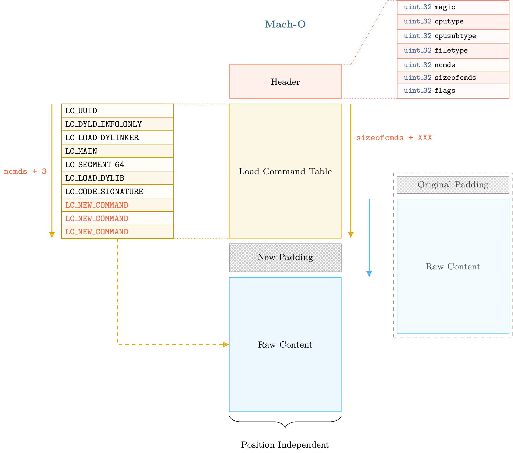
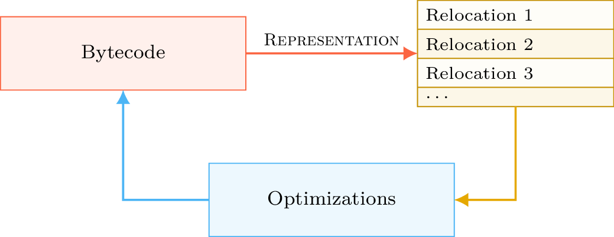
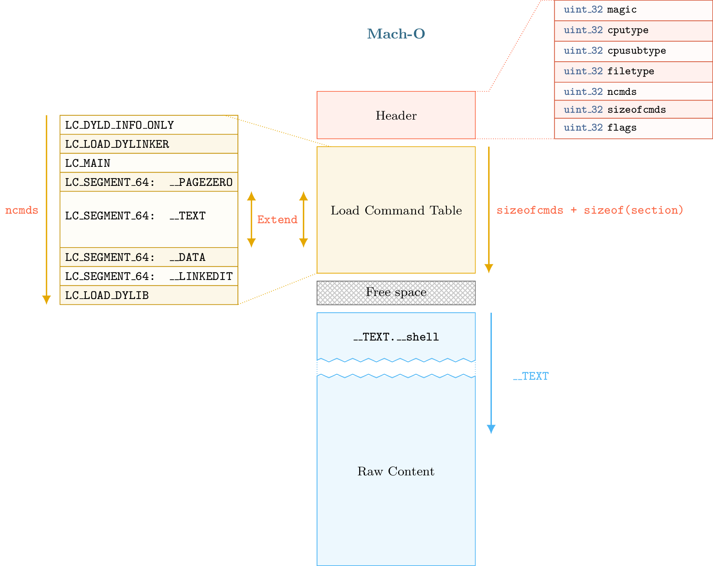

11 - Mach-O Modification
-------------------------

The purpose of this tutorial is to introduce the LIEF API to deal with Mach-O binaries and their modification.
It also cover some internal parts of the Mach-O format.

Files used in this tutorial are available on the `tutorials repository <https://github.com/lief-project/tutorials/tree/master/11_macho_modifications>`_

By Romain Thomas - `@rh0main <https://twitter.com/rh0main>`_

------

Introduction
~~~~~~~~~~~~

Basic Mach-O binaries (i.e. non FAT Mach-O) can be represented in fours parts that are described in the figure below:

.. figure:: ../_static/tutorial/11/image.png
  :align: center

The first part begins with an header that can access through the :attr:`lief.MachO.Binary.header` attribute then follow the load commands table that can be iterated with the :attr:`lief.MachO.Binary.load_commands` attribute.
In the third part we can optionnaly padding and finally we have the raw data (assembly code, rebase opcodes, signature, ...)

The load command table begins at offset ``sizeof(macho_header)`` and ends at ``sizeof(macho_header) + sizeof_cmds``

Load commands like :class:`~lief.MachO.SegmentCommand`, :class:`~lief.MachO.DyldInfo`, ... can be associated with *raw data* that are located after the load command and the padding section.
This padding section is usually used by OSX to sign the binary after the compilation. Basically ``codesign`` add a LC_CODE_SIGNATURE or LC_DIR_SINGATURE command in the padding area and extend the *raw data* section with
the signature.

As Load Commands are the base unit of the Mach-O format (Segment, Shared libraries, entrypoint, ... are somehow *commands*), being able to add arbitrary command to a binary enables interesting things like code injection,
anti-analysis, ...

There exists different techniques to add new command in a Mach-O binary:

  * One can replace an existing load command that is not mandatory for the execution like :class:`~lief.MachO.UUIDCommand` or :class:`~lief.MachO.CodeSignature`.
  * One can also use the padding area.

The main limitation with these techniques is that the size and the number of the commands that can added is tied to the padding section size or to the size of the command replaced.
For example if the padding size is very tiny, we can't add a LC_DYLIB command whose the library path is very long. Moreover codesign may complain that there is not enough spaces to add a LC_CODE_SIGNATURE as we are using the space
could be reserved for it.

Next parts deal with Mach-O format modification and how LIEF managed to address this limitation

When PIE makes thing easier
~~~~~~~~~~~~~~~~~~~~~~~~~~~

By default, OSX and iOS binaries are compiled with flags that make them position independent. The instructions generated by the compiler will use
relative addressing associated with relocations when accessing to memory space.

To simplify (not accurate), PIE binaries enables to *map* the raw data (from the diagram above) at a random base address.
As it can be mapped at a random base address, it can also be shifted within the format.

Such transformation also requires to keep a consistent state of the format metadata. Especially, when shifting the raw data we need to update relocations, segment offsets, etc. Once the raw data shifted and
the metadata updated, we have arbitrary space between the load command table and the raw data whose the size depends on the shift size. Thus we can extend the load command table as shown in this figure

Keeping a consistent state of the format after the shift transformation is not easy. In the next part, we introduce some aspects of the Mach-O format that is updated after the shift.

When Mach-O makes thing harder
~~~~~~~~~~~~~~~~~~~~~~~~~~~~~~

To keep the format consistency after the shift operation, we need to update several load command (if present) of the Mach-O format:

  * :attr:`lief.MachO.SymbolCommand.symbol_offset` / :attr:`lief.MachO.SymbolCommand.strings_offset`
  * :attr:`lief.MachO.DataInCode.data_offset`, :attr:`lief.MachO.CodeSignature.data_offset`, :attr:`lief.MachO.SegmentSplitInfo.data_offset`
  * :attr:`lief.MachO.MainCommand.entrypoint`
  * :attr:`lief.MachO.FunctionStarts.data_offset` / :attr:`lief.MachO.FunctionStarts.functions`
  * :class:`~lief.MachO.DynamicSymbolCommand`
  * :attr:`lief.MachO.Section.offset` / :attr:`lief.MachO.Section.virtual_address` and :attr:`lief.MachO.SegmentCommand.offset` / :attr:`lief.MachO.file_offset.virtual_address`
  * ...

We also need to update relocations and export information. Whereas ELF and PE formats use some kind of ``struct`` for relocations and exports information, Mach-O format uses a bytecode to *rebase* the binary and a `trie <https://en.wikipedia.org/wiki/Trie>`_ structure to store export information. It makes the update more difficult as simplify updating a struct attribute.

Let start with the rebase process

Rebase bytecode
***************

As mentioned in the previous part, recent Mach-O loader uses a bytecode to relocate (or rebase) the binary when mapped at a different address base.

.. warning::

  One can notice that :class:`~lief.MachO.Section` object has a :attr:`~lief.MachO.Section.relocation_offset` attribute. Actually, it seems to be only
  used for Mach-O object files (:attr:`lief.MachO.FILE_TYPES.OBJECT`) or in association with old version of the Mach-O loader.

  This offset points to a list of reloction structures (not bytecode) whose number is defined by :attr:`~lief.MachO.Section.numberof_relocations`.

The offset and size of the bytecode is given in :attr:`lief.MachO.DyldInfo.rebase` attribute. Basically bytecode is compound of :class:`~lief.MachO.REBASE_OPCODES` that set address to relocation.

To know which addresses need to be relocated, we have to interpret this bytecode.

The :attr:`lief.MachO.DyldInfo.show_rebases_opcodes` attribute return a pretty view of this bytecode:

.. code-block:: python

  import lief
  app = lief.parse("MachO64_x86-64_binary_id.bin")
  print(app.dyld_info.show_rebases_opcodes)

.. code-block:: text

  [SET_TYPE_IMM] Type: POINTER
  [SET_SEGMENT_AND_OFFSET_ULEB] Segment Index := 2 (__DATA) Segment Offset := 0x20
  [DO_REBASE_ULEB_TIMES]
    for i in range(26):
        rebase(POINTER, __DATA, 0x20)
        Segment Offset += 0x8 (0x28)

        rebase(POINTER, __DATA, 0x28)
        Segment Offset += 0x8 (0x30)

        rebase(POINTER, __DATA, 0x30)
        Segment Offset += 0x8 (0x38)

        rebase(POINTER, __DATA, 0x38)
        Segment Offset += 0x8 (0x40)

        rebase(POINTER, __DATA, 0x40)
        Segment Offset += 0x8 (0x48)
        ...
  [DONE]

For the above output, we can see that the load will rebase **pointer** in the ``__DATA`` segment at offset ``0x20, 0x28, 0x38, ...``.
This output is not very friendly for those whose who only care about what exact address is relocated. LIEF also provide a **representation** of these relocations which is the result of the **interepretation** of the bytecode.

The :attr:`lief.MachO.Binary.relocations` attribute return an iterator over :class:`lief.MachO.Relocation` objects that **model** a relocation in a similar object as :class:`lief.ELF.Relocation` and :class:`lief.PE.Relocation`.

.. code-block:: python

  for relocation in app.relocations:
    print(relocations)

.. code-block:: text

  100002020 POINTER 64 DYLDINFO  __DATA.__la_symbol_ptr _err
  100002028 POINTER 64 DYLDINFO  __DATA.__la_symbol_ptr _errx
  100002030 POINTER 64 DYLDINFO  __DATA.__la_symbol_ptr _exit
  100002038 POINTER 64 DYLDINFO  __DATA.__la_symbol_ptr _fprintf
  100002040 POINTER 64 DYLDINFO  __DATA.__la_symbol_ptr _free
  100002048 POINTER 64 DYLDINFO  __DATA.__la_symbol_ptr _fwrite
  ...

With this representation, patching relocations is simply an update of the :class:`lief.MachO.Relocation.address`  attribute. When the Mach-O builder reconstruct the final binary, it **regenerates** and optimize the rebase bytecode
according to the updated relocations. The process can be summed-up with the following diagram:

Binding bytecode
****************

The Mach-O loader uses also a bytecode to bind imported functions or imported symbols. Actually this bytecode is used for three different methods of binding:

  * Normal binding
  * Weak binding (Used when the same symbol is defined multiple times)
  * Lazy binding (Bound only when there is an access to the symbol)

The bytecode can be pretty printed with the :attr:`~lief.MachO.DyldInfo.show_bind_opcodes`, :attr:`~lief.MachO.DyldInfo.show_weak_bind_opcodes` and :attr:`~lief.MachO.DyldInfo.show_lazy_bind_opcodes`:

.. code-block:: python

  print(app.dyld_info.show_bind_opcodes)

.. code-block:: text

  [SET_DYLIB_ORDINAL_IMM]
      Library Ordinal := 1
  [SET_SYMBOL_TRAILING_FLAGS_IMM]
      Symbol name := ___stderrp
      Is Weak ? false
  [SET_TYPE_IMM]
      Type := POINTER
  [SET_SEGMENT_AND_OFFSET_ULEB]
      Segment := __DATA
      Segment Offset := 0x10
  [DO_BIND]
      bind(POINTER, __DATA, 0x10, ___stderrp, library_ordinal=/usr/lib/libSystem.B.dylib, addend=0, is_weak_import=false)
      Segment Offset += 0x8 (0x18)

The representation and the update process is the same as described in the section about *Rebase bytecode*

Export Trie
***********

Regarding to exported functions and exported symbols, Mach-O format uses a *trie* structure to store export information. Trie offset and size is given in the :attr:`~lief.MachO.DyldInfo.export_trie` attribute.
Once parsed, trie entries are represented woth the :class:`~lief.MachO.ExportInfo` object and can be retrieved with the :attr:`~lief.MachO.Symbol.export_info` attribute.

.. code-block:: python

  app = lief.parse("FAT_MachO_x86_x86-64_library_libdyld.dylib")
  print(app.dyld_info.show_export_trie)

.. code-block:: text

    ...
    _@off.0x17
        _N@off.0x21
            _NS@off.0x50
                _NSI@off.0x5d
                    _NSInstallLinkEditErrorHandlers@off.0x11d
                    _NSInstallLinkEditErrorHandlers{addr: 0x126b, flags: 0}
    ...

.. code-block:: python

  for s in app.symbols:
    if s.has_export_info:
      print(s.export_info)

.. code-block:: text

  Node Offset: 128
  Flags:       0
  Address:     126b
  Symbol:      _NSInstallLinkEditErrorHandlers

  Node Offset: 5f6
  Flags:       0
  Address:     2168
  Symbol:      _NSIsSymbolDefinedInObjectFileImage

  Node Offset: 1a0
  Flags:       0
  Address:     1391
  Symbol:      _NSIsSymbolNameDefined
  ...

After the shift operation, export information are patched by updating the :attr:`~lief.MachO.ExportInfo.address` then a new export trie is generated from the previous updates.

Removing signature
~~~~~~~~~~~~~~~~~~

Removing the LC_CODE_SIGNATURE command is a basic modification that is pretty usefull when modifying Mach-O format. Since the signature
check the integrity of the binary, we need to remove this command if we want eventually to re-sign the binary once all modifications finished.

LIEF provides the :meth:`lief.MachO.Binary.remove_signature` to remove this command:

.. code-block:: python

  ssh = lief.parse("/usr/bin/ssh")

  ssh.remove_signature()

  ssh.write("ssh.nosign")

Code Injection with shared libraries
~~~~~~~~~~~~~~~~~~~~~~~~~~~~~~~~~~~~

As explained in the talk about format modification, one way to inject code within the memory space of a program is to force the loader to load a library (that was not previously linked) with a constructor function.

For a Mach-O binary, is can achieved by adding a one of these load commands:

  * :attr:`~lief.MachO.LOAD_COMMAND_TYPES.ID_DYLIB`
  * :attr:`~lief.MachO.LOAD_COMMAND_TYPES.LOAD_DYLIB`
  * ...

Let's take an example with ``clang``. First we need to create a tiny library which define a constructor:

.. code-block:: cpp

  #include <stdio.h>
  #include <stdlib.h>

  __attribute__((constructor))
  void my_constructor(void) {
    printf("Run payload\n");
  }

That is complied with

.. code-block:: console

  $ clang -fPIC -shared libexample.c -o libexample.dylib

Then we add a new :attr:`~lief.MachO.LOAD_COMMAND_TYPES.LOAD_DYLIB` with the :meth:`lief.MachO.Binary.add_library` method:

.. code-block:: python

  import lief
  clang = lief.parse("/usr/bin/clang")

  clang.add_library("/Users/romain/libexample.dylib")

  clang.write("/tmp/clang.new")

Finally we can see that ``Run payload`` is printed before the main execution of clang:

.. code-block:: console

  $ chmod u+x /tmp/clang.new

  $ /tmp/clang.new
  Run payload
  clang: error: no input files

We can also observe the new :attr:`~lief.MachO.LOAD_COMMAND_TYPES.LOAD_DYLIB` command with otool:

.. code-block:: console

  $ otool -l /tmp/clang.new|grep -C4 LOAD_DYLIB

  ...
  cmdsize 16
  dataoff 73864
  datasize 0
  Load command 16
          cmd LC_LOAD_DYLIB
      cmdsize 56
         name /Users/romain/libexample.dylib (offset 24)
   time stamp 2 Thu Jan  1 01:00:02 1970
      current version 0.0.0

Adding Section/Segment
~~~~~~~~~~~~~~~~~~~~~~

As we can allocate arbitrary space between the load command table and the raw data, we can also extend an existing :class:`~lief.MachO.LoadCommand`.
Especially, Mach-O segments are basically commands that are associated with the LIEF object :class:`lief.MachO.SegmentCommand` and whose type is either :attr:`~lief.MachO.LOAD_COMMAND_TYPES.SEGMENT` or :attr:`~lief.MachO.LOAD_COMMAND_TYPES.SEGMENT64`.

To add a new section in the ``__TEXT`` segment, we must extend the load command associated with this segment so that we can add a new section structure. We must also reserve space for the content of the section.
As the content of the ``__TEXT`` segment begin at offset 0 and finish somewhere in the raw data, the right place to insert the new content is between the end of the load command table and the beginning of the raw data:

The process described above is implemented through the :meth:`lief.MachO.Binary.add_section` method.

Here is an example in which we will inject assembly code that execute ``/bin/sh``:

.. code-block:: python

  app = lief.parse("MachO64_x86-64_binary_id.bin")

  raw_shell = [...] # Assembly code
  section = lief.MachO.Section("__shell", raw_shell)

  section.alignment = 2
  section += lief.MachO.SECTION_FLAGS.SOME_INSTRUCTIONS
  section += lief.MachO.SECTION_FLAGS.PURE_INSTRUCTIONS

  section = app.add_section(section)
  print(section)

Then we can change the entrypoint by setting the :attr:`lief.MachO.MainCommand.entrypoint` attribute:

.. code-block:: python

  __TEXT = app.get_segment("__TEXT")
  app.main_command.entrypoint = section.virtual_address - __TEXT.virtual_address

Finally, we remove the signature and reconstruct the binary:

.. code-block:: python

  app.remove_signature()
  app.write("./id.modified")

The execution of ``id.modified`` should have a similar output:

.. code-block:: console

  Mac-mini:tmp romain$ ./id.modified
  tmp @ [romain] $

.. rubric:: Notes

.. [1] * http://mylifewithandroid.blogspot.fr/2009/05/about-quick-method-invocation.html
       * https://github.com/JesusFreke/smali/wiki/UnresolvableOdexInstruction

.. [2] Usually the ones from the Android Framework

.. [3] They have other nices features like a disassembler, pseudo-code, ... that are not cover in LIEF

.. [4] Dextra by Jonathan Levin: http://newandroidbook.com/tools/dextra.html

.. [5] vdexExtractor by Anestis Bechtsoudis: https://github.com/anestisb/vdexExtractor

.. [6] smali by JesusFreke: https://github.com/JesusFreke/smali/wiki/DeodexInstructions

.. rubric:: API

* :meth:`lief.MachO.Binary.add_section`
* :meth:`lief.MachO.Binary.add_library`

